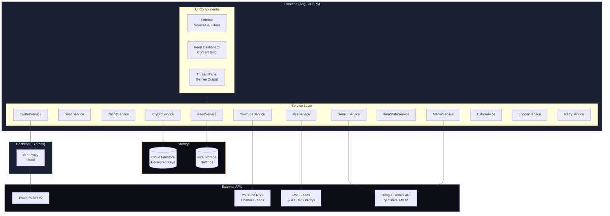

# DevPulse

<div align="center">

🌐 **Languages**: [Português](README.md) • [English](#) • [Español](README.es.md)


**Transform content into engaging Twitter threads with AI**

[Features](#features) • [Architecture](#architecture) • [Quick Start](#quick-start) • [Deploy](#deploy) • [Security](#security)

</div>

---

## Overview

DevPulse is a modern web application that aggregates content from multiple sources (Twitter/X, YouTube, RSS feeds, blogs) and uses Google Gemini AI to generate Twitter threads optimized for maximum engagement. With automatic source type detection and intelligent media extraction.

### Key Features

| Feature | Description |
|---------|-------------|
| 🌐 **Multi-source Aggregation** | Combine Twitter/X, YouTube, RSS and blogs into a single feed |
| 🔍 **Automatic Type Detection** | Automatically identifies Twitter, YouTube, RSS or Blog by URL |
| 📎 **Adhoc Content** | Generate threads from any URL or image with Gemini Vision |
| 📺 **YouTube Support** | Fetches videos via RSS from channels using Channel ID |
| 🖼️ **Media Assets Tab** | View and download original media extracted from feeds |
| 🤖 **AI Thread Generation** | Gemini 3.0 Flash creates platform-optimized threads |
| 🎨 **AI Media Generation** | Generate images (Nano Banana) and videos (Veo 3.1) |
| 📱 **Mobile Responsive** | Adaptive interface for smartphone use |
| 🐦 **Twitter Video Extraction** | Extracts high-quality MP4 via host-swap (pbs.twimg) |
| 🔐 **End-to-End Encryption** | API keys encrypted at rest with AES-256-GCM |
| 🌍 **8 Languages** | Full i18n: PT-BR, PT-PT, ES, FR, ZH, JA, DE, EN |
| 🔑 **BYOK Model** | Bring Your Own Key - users provide their own API keys |
| 📊 **Global Counter** | Displays total content generated by all users in real-time |
| ☁️ **Cross-Device Sync** | Feeds and settings synced via Cloud Firestore |

---

## Architecture



### Tech Stack

| Layer | Technology | Purpose |
|-------|------------|---------|
| **Frontend** | Angular 21.1 | SPA framework with signals |
| **Authentication** | Firebase Auth | Google OAuth 2.0 |
| **Database** | Cloud Firestore | Encrypted settings |
| **Backend** | Express.js | API proxy for CORS bypass |
| **AI** | Gemini 3.0 Flash | Text generation |
| **AI Image** | Nano Banana | AI image generation |
| **AI Video** | Veo 3.1 | AI video generation |
| **Encryption** | Web Crypto API | AES-256-GCM client-side |

---

## Quick Start

### Prerequisites

- Node.js 22+
- npm 10+
- Google Cloud project with Firebase enabled

### Installation

```bash
# Clone the repository
git clone https://github.com/your-username/devpulse.git
cd devpulse

# Install frontend dependencies
npm install

# Install server dependencies
cd server && npm install && cd ..
```

### Development

```bash
# Terminal 1: Start the proxy server
npm run server

# Terminal 2: Start the Angular dev server
npm run dev
```

Open http://localhost:4200 in your browser.

---

## Configuration

### 1. Environment Setup (Required)

Environment files contain sensitive configurations and are **not committed** to Git.

```bash
# Copy the environment template
cp src/environments/environment.example.ts src/environments/environment.ts
cp src/environments/environment.example.ts src/environments/environment.prod.ts

# Edit the files with your settings
```

**Required fields in `environment.ts`:**

| Field | Description | Where to get |
|-------|-------------|--------------|
| `appSecret` | Unique string for encryption | Generate a secure random string |
| `firebase.apiKey` | Firebase API Key | Firebase Console → Project Settings |
| `firebase.authDomain` | Auth domain | Firebase Console → Project Settings |
| `firebase.projectId` | Project ID | Firebase Console → Project Settings |
| `firebase.storageBucket` | Storage bucket | Firebase Console → Project Settings |
| `firebase.messagingSenderId` | Sender ID | Firebase Console → Project Settings |
| `firebase.appId` | App ID | Firebase Console → Project Settings |

> ⚠️ **IMPORTANT**: Never commit `environment.ts` or `environment.prod.ts` files! They are already in `.gitignore`.

### 2. Firebase Setup

1. Create a project in [Firebase Console](https://console.firebase.google.com/)
2. Enable **Authentication** → Google Sign-In
3. Create a **Firestore Database**
4. Configure **Firestore Security Rules**:

```javascript
rules_version = '2';
service cloud.firestore {
  match /databases/{database}/documents {
    // Users can only access their own data
    match /users/{userId}/{subcollection}/{document=**} {
      allow read, write: if request.auth != null && request.auth.uid == userId;
    }
    // Global stats - any authenticated user can read/increment
    match /stats/{statId} {
      allow read, write: if request.auth != null;
    }
    // Block all other access
    match /{document=**} {
      allow read, write: if false;
    }
  }
}
```

### 3. User API Keys (BYOK)

DevPulse uses the **Bring Your Own Key** model:

1. User logs in with Google
2. User enters their Gemini API key and (optionally) Twitter Bearer Token
3. Keys are **encrypted client-side** with AES-256-GCM
4. Only encrypted data is stored in Firestore
5. Keys are decrypted client-side when needed

**Get your keys:**
- Gemini API: [Google AI Studio](https://aistudio.google.com/app/apikey)
- Twitter API: [Twitter Developer Portal](https://developer.twitter.com/)

---

## Security

### Encryption at Rest

All sensitive user data is encrypted client-side before storing in Firestore:

```
User API Key
     │
     ▼ PBKDF2 (100,000 iterations)
┌─────────────────────────────────┐
│  Derived Key (UID + salt)       │
└─────────────────────────────────┘
     │
     ▼ AES-256-GCM
┌─────────────────────────────────┐
│  Encrypted Base64 + IV          │
└─────────────────────────────────┘
     │
     ▼
   Firestore (encrypted data only)
```

**Security properties:**
- Keys never leave the browser unencrypted
- Each user has a unique derived encryption key
- IV is random per encryption operation
- Even database leaks don't expose API keys

### Authentication

- Google OAuth 2.0 via Firebase Authentication
- Optional domain restriction (e.g., only `@company.com`)
- Session managed by Firebase SDK

---

## Internationalization

DevPulse supports 8 languages with full UI localization:

| Flag | Language | Code | File |
|------|----------|------|------|
| 🇧🇷 | Português (Brasil) | `pt-br` | `pt-br.ts` |
| 🇵🇹 | Português (Portugal) | `pt-pt` | `pt-pt.ts` |
| 🇪🇸 | Español | `es` | `es.ts` |
| 🇫🇷 | Français | `fr` | `fr.ts` |
| 🇨🇳 | 中文 | `zh` | `zh.ts` |
| 🇯🇵 | 日本語 | `ja` | `ja.ts` |
| 🇩🇪 | Deutsch | `de` | `de.ts` |
| 🇬🇧 | English | `en` | `en.ts` |

Language selection is available on the login screen and in settings. The selected language is also injected into AI prompts for localized thread generation.

---

## Deploy

### Cloud Run (Recommended)

See [deploy/cloudrun/README.md](deploy/cloudrun/README.md) for detailed instructions.

**Quick deploy:**

```bash
export GOOGLE_CLOUD_PROJECT="your-project-id"
./deploy/cloudrun/deploy.sh
```

### Custom Domain

After deploying to Cloud Run:

1. Map your domain in Cloud Console
2. Add DNS records at your registrar (e.g., GoDaddy):
   - `CNAME`: `your-subdomain` → `ghs.googlehosted.com`
3. Wait for SSL certificate provisioning (automatic)

---

## License

This project is licensed under the Apache License 2.0 - see the [LICENSE](LICENSE) file for details.

---

## Disclaimer

This is an experimental research prototype. It is not an official Google product and has no support or warranties. Use at your own risk.
