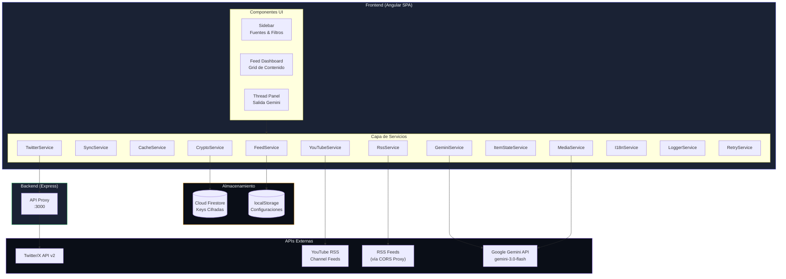

# DevPulse

<div align="center">

🌐 **Idiomas / Languages**: [Português](README.md) • [English](README.en.md) • [Español](#)


**Transforma contenido en hilos atractivos para Twitter con IA**

[Características](#características) • [Arquitectura](#arquitectura) • [Inicio Rápido](#inicio-rápido) • [Deploy](#deploy) • [Seguridad](#seguridad)

</div>

---

## Visión General

DevPulse es una aplicación web moderna que agrega contenido de múltiples fuentes (Twitter/X, YouTube, feeds RSS, blogs) y utiliza la IA Google Gemini para generar hilos de Twitter optimizados para máximo engagement. Con detección automática de tipo de fuente y extracción inteligente de medios.

### Características Principales

| Característica | Descripción |
|----------------|-------------|
| 🌐 **Agregación Multi-fuente** | Combina Twitter/X, YouTube, RSS y blogs en un único feed |
| 🔍 **Detección Automática de Tipo** | Identifica automáticamente Twitter, YouTube, RSS o Blog por URL |
| 📎 **Contenido Adhoc** | Genera hilos de cualquier URL o imagen con Gemini Vision |
| 📺 **Soporte YouTube** | Busca videos vía RSS de canales usando Channel ID |
| 🖼️ **Pestaña Media Assets** | Visualiza y descarga medios originales extraídos de los feeds |
| 🤖 **Generación de Hilos con IA** | Gemini 3.0 Flash crea hilos optimizados por plataforma |
| 🎨 **Generación de Medios con IA** | Genera imágenes (Nano Banana) y videos (Veo 3.1) |
| 📱 **Responsive Móvil** | Interfaz adaptativa para uso en smartphones |
| 🐦 **Extracción de Video de Twitter** | Extrae MP4 de alta calidad vía host-swap (pbs.twimg) |
| 🔐 **Cifrado Extremo a Extremo** | API keys cifradas en reposo con AES-256-GCM |
| 🌍 **8 Idiomas** | i18n completo: PT-BR, PT-PT, ES, FR, ZH, JA, DE, EN |
| 🔑 **Modelo BYOK** | Bring Your Own Key - usuarios proporcionan sus propias API keys |

---

## Arquitectura



### Stack Tecnológico

| Capa | Tecnología | Propósito |
|------|------------|-----------|
| **Frontend** | Angular 21.1 | Framework SPA con signals |
| **Autenticación** | Firebase Auth | Google OAuth 2.0 |
| **Base de Datos** | Cloud Firestore | Configuraciones cifradas |
| **Backend** | Express.js | Proxy API para bypass de CORS |
| **IA** | Gemini 3.0 Flash | Generación de texto |
| **IA Imagen** | Nano Banana | Generación de imágenes con IA |
| **IA Video** | Veo 3.1 | Generación de videos con IA |
| **Cifrado** | Web Crypto API | AES-256-GCM client-side |

---

## Inicio Rápido

### Prerrequisitos

- Node.js 22+
- npm 10+
- Proyecto en Google Cloud con Firebase habilitado

### Instalación

```bash
# Clona el repositorio
git clone https://github.com/tu-usuario/devpulse.git
cd devpulse

# Instala las dependencias del frontend
npm install

# Instala las dependencias del servidor
cd server && npm install && cd ..
```

### Desarrollo

```bash
# Terminal 1: Inicia el servidor proxy
npm run server

# Terminal 2: Inicia el servidor de desarrollo Angular
npm run dev
```

Abre http://localhost:4200 en el navegador.

---

## Configuración

### 1. Configuración del Entorno (Obligatorio)

Los archivos de entorno contienen configuraciones sensibles y **no se commitean** en Git.

```bash
# Copia la plantilla de entorno
cp src/environments/environment.example.ts src/environments/environment.ts
cp src/environments/environment.example.ts src/environments/environment.prod.ts

# Edita los archivos con tus configuraciones
```

**Campos obligatorios en `environment.ts`:**

| Campo | Descripción | Dónde obtener |
|-------|-------------|---------------|
| `appSecret` | String único para cifrado | Genera un string aleatorio seguro |
| `firebase.apiKey` | API Key de Firebase | Firebase Console → Project Settings |
| `firebase.authDomain` | Dominio de autenticación | Firebase Console → Project Settings |
| `firebase.projectId` | ID del proyecto | Firebase Console → Project Settings |
| `firebase.storageBucket` | Bucket de storage | Firebase Console → Project Settings |
| `firebase.messagingSenderId` | ID del sender | Firebase Console → Project Settings |
| `firebase.appId` | ID de la app | Firebase Console → Project Settings |

> ⚠️ **IMPORTANTE**: ¡Nunca commitees los archivos `environment.ts` o `environment.prod.ts`! Ya están en `.gitignore`.

### 2. Configuración de Firebase

1. Crea un proyecto en [Firebase Console](https://console.firebase.google.com/)
2. Habilita **Authentication** → Google Sign-In
3. Crea una **Firestore Database**
4. Configura las **Firestore Security Rules**:

```javascript
rules_version = '2';
service cloud.firestore {
  match /databases/{database}/documents {
    // Usuarios solo pueden acceder a sus propios datos
    match /users/{userId}/{subcollection}/{document=**} {
      allow read, write: if request.auth != null && request.auth.uid == userId;
    }
    // Estadísticas globales - cualquier usuario autenticado puede leer/incrementar
    match /stats/{statId} {
      allow read, write: if request.auth != null;
    }
    // Bloquear todo el resto
    match /{document=**} {
      allow read, write: if false;
    }
  }
}
```

### 3. API Keys del Usuario (BYOK)

DevPulse usa el modelo **Bring Your Own Key**:

1. Usuario inicia sesión con Google
2. Usuario ingresa su Gemini API key y (opcionalmente) Twitter Bearer Token
3. Keys son **cifradas client-side** con AES-256-GCM
4. Solo datos cifrados son almacenados en Firestore
5. Keys son descifradas client-side cuando es necesario

**Obtén tus keys:**
- Gemini API: [Google AI Studio](https://aistudio.google.com/app/apikey)
- Twitter API: [Twitter Developer Portal](https://developer.twitter.com/)

---

## Seguridad

### Cifrado en Reposo

Todos los datos sensibles del usuario son cifrados client-side antes de almacenar en Firestore:

```
API Key del Usuario
     │
     ▼ PBKDF2 (100.000 iteraciones)
┌─────────────────────────────────┐
│  Clave Derivada (UID + salt)    │
└─────────────────────────────────┘
     │
     ▼ AES-256-GCM
┌─────────────────────────────────┐
│  Base64 Cifrado + IV            │
└─────────────────────────────────┘
     │
     ▼
   Firestore (solo datos cifrados)
```

**Propiedades de seguridad:**
- Keys nunca salen del navegador sin cifrado
- Cada usuario tiene una clave de cifrado derivada única
- IV es aleatorio por operación de cifrado
- Incluso filtraciones de la base no exponen las API keys

### Autenticación

- Google OAuth 2.0 vía Firebase Authentication
- Restricción de dominio opcional (ej: solo `@empresa.com`)
- Sesión gestionada por el SDK de Firebase

---

## Internacionalización

DevPulse soporta 8 idiomas con localización completa de la UI:

| Bandera | Idioma | Código | Archivo |
|---------|--------|--------|---------|
| 🇧🇷 | Português (Brasil) | `pt-br` | `pt-br.ts` |
| 🇵🇹 | Português (Portugal) | `pt-pt` | `pt-pt.ts` |
| 🇪🇸 | Español | `es` | `es.ts` |
| 🇫🇷 | Français | `fr` | `fr.ts` |
| 🇨🇳 | 中文 | `zh` | `zh.ts` |
| 🇯🇵 | 日本語 | `ja` | `ja.ts` |
| 🇩🇪 | Deutsch | `de` | `de.ts` |
| 🇬🇧 | English | `en` | `en.ts` |

La selección de idioma está disponible en la pantalla de login y en configuraciones. El idioma seleccionado también se inyecta en los prompts de IA para generación de hilos localizados.

---

## Deploy

### Cloud Run (Recomendado)

Ver [deploy/cloudrun/README.md](deploy/cloudrun/README.md) para instrucciones detalladas.

**Deploy rápido:**

```bash
export GOOGLE_CLOUD_PROJECT="tu-project-id"
./deploy/cloudrun/deploy.sh
```

### Dominio Personalizado

Después de hacer deploy en Cloud Run:

1. Mapea tu dominio en Cloud Console
2. Agrega registros DNS en tu registrador (ej: GoDaddy):
   - `CNAME`: `tu-subdominio` → `ghs.googlehosted.com`
3. Espera el provisionamiento del certificado SSL (automático)

---

## Licencia

Este proyecto está licenciado bajo la Apache License 2.0 - ver el archivo [LICENSE](LICENSE) para detalles.

---

## Aviso Legal

Este es un prototipo experimental de investigación. No es un producto oficial de Google y no tiene soporte ni garantías. Úsalo bajo tu propio riesgo.
