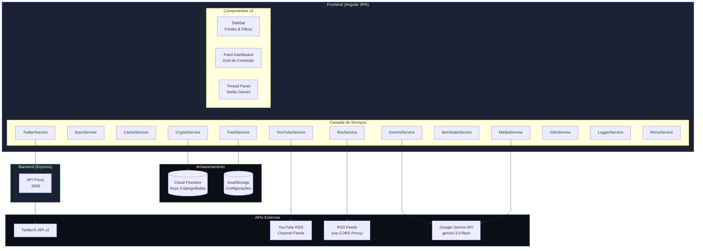

# DevPulse

<div align="center">

🌐 **Idiomas / Languages**: [Português](#) • [English](README.en.md) • [Español](README.es.md)


**Transforme conteúdo em threads engajadoras para o Twitter com IA**

[Funcionalidades](#funcionalidades) • [Arquitetura](#arquitetura) • [Início Rápido](#início-rápido) • [Deploy](#deploy) • [Segurança](#segurança)

</div>

---

## Visão Geral

DevPulse é uma aplicação web moderna que agrega conteúdo de múltiplas fontes (Twitter/X, YouTube, RSS feeds, blogs) e utiliza a IA Google Gemini para gerar threads do Twitter otimizadas para máximo engajamento. Com detecção automática de tipo de fonte e extração inteligente de mídia.

### Principais Funcionalidades

| Funcionalidade | Descrição |
|----------------|-----------|
| 🌐 **Agregação Multi-fonte** | Combine Twitter/X, YouTube, RSS e blogs em um único feed |
| 🔍 **Detecção Automática de Tipo** | Identifica automaticamente Twitter, YouTube, RSS ou Blog pela URL |
| 📎 **Conteúdo Adhoc** | Gere threads de qualquer URL ou imagem com Gemini Vision |
| 📺 **Suporte YouTube** | Busca vídeos via RSS de canais usando Channel ID |
| 🖼️ **Aba Media Assets** | Visualize e baixe mídia original extraída dos feeds |
| 🤖 **Geração de Threads com IA** | Gemini 3.0 Flash cria threads otimizadas por plataforma |
| 🎨 **Geração de Mídia com IA** | Gere imagens (Nano Banana) e vídeos (Veo 3.1) |
| 📱 **Mobile Responsive** | Interface adaptativa para uso em smartphones |
| 🐦 **Extração de Vídeo do Twitter** | Extrai MP4 de alta qualidade via host-swap (pbs.twimg) |
| 🔐 **Criptografia Ponta a Ponta** | API keys criptografadas em repouso com AES-256-GCM |
| 🌍 **8 Idiomas** | i18n completo: PT-BR, PT-PT, ES, FR, ZH, JA, DE, EN |
| 🔑 **Modelo BYOK** | Bring Your Own Key - usuários fornecem suas próprias API keys |

---

## Arquitetura



### Stack Tecnológica

| Camada | Tecnologia | Propósito |
|--------|------------|-----------|
| **Frontend** | Angular 21.1 | Framework SPA com signals |
| **Autenticação** | Firebase Auth | Google OAuth 2.0 |
| **Banco de Dados** | Cloud Firestore | Configurações criptografadas |
| **Backend** | Express.js | Proxy API para bypass de CORS |
| **IA** | Gemini 3.0 Flash | Geração de texto |
| **IA Imagem** | Nano Banana | Geração de imagens com IA |
| **IA Vídeo** | Veo 3.1 | Geração de vídeos com IA |
| **Criptografia** | Web Crypto API | AES-256-GCM client-side |

---

## Início Rápido

### Pré-requisitos

- Node.js 22+
- npm 10+
- Projeto no Google Cloud com Firebase habilitado

### Instalação

```bash
# Clone o repositório
git clone https://github.com/seu-usuario/devpulse.git
cd devpulse

# Instale as dependências do frontend
npm install

# Instale as dependências do servidor
cd server && npm install && cd ..
```

### Desenvolvimento

```bash
# Terminal 1: Inicie o servidor proxy
npm run server

# Terminal 2: Inicie o servidor de desenvolvimento Angular
npm run dev
```

Abra http://localhost:4200 no navegador.

---

## Configuração

### 1. Configuração do Ambiente (Obrigatório)

Os arquivos de ambiente contêm configurações sensíveis e **não são commitados** no Git.

```bash
# Copie o template de ambiente
cp src/environments/environment.example.ts src/environments/environment.ts
cp src/environments/environment.example.ts src/environments/environment.prod.ts

# Edite os arquivos com suas configurações
```

**Campos obrigatórios em `environment.ts`:**

| Campo | Descrição | Onde obter |
|-------|-----------|------------|
| `appSecret` | String única para criptografia | Gere uma string aleatória segura |
| `firebase.apiKey` | API Key do Firebase | Firebase Console → Project Settings |
| `firebase.authDomain` | Domínio de autenticação | Firebase Console → Project Settings |
| `firebase.projectId` | ID do projeto | Firebase Console → Project Settings |
| `firebase.storageBucket` | Bucket de storage | Firebase Console → Project Settings |
| `firebase.messagingSenderId` | ID do sender | Firebase Console → Project Settings |
| `firebase.appId` | ID do app | Firebase Console → Project Settings |

> ⚠️ **IMPORTANTE**: Nunca commite os arquivos `environment.ts` ou `environment.prod.ts`! Eles já estão no `.gitignore`.

### 2. Configuração do Firebase

1. Crie um projeto no [Firebase Console](https://console.firebase.google.com/)
2. Habilite **Authentication** → Google Sign-In
3. Crie um **Firestore Database**
4. Configure as **Firestore Security Rules**:

```javascript
rules_version = '2';
service cloud.firestore {
  match /databases/{database}/documents {
    // Usuários só podem acessar seus próprios dados
    match /users/{userId}/{subcollection}/{document=**} {
      allow read, write: if request.auth != null && request.auth.uid == userId;
    }
    // Estatísticas globais - qualquer usuário autenticado pode ler/incrementar
    match /stats/{statId} {
      allow read, write: if request.auth != null;
    }
    // Bloqueia todo o resto
    match /{document=**} {
      allow read, write: if false;
    }
  }
}
```

### 3. API Keys do Usuário (BYOK)

O DevPulse usa o modelo **Bring Your Own Key**:

1. Usuário faz login com Google
2. Usuário insere sua Gemini API key e (opcionalmente) Twitter Bearer Token
3. Keys são **criptografadas client-side** com AES-256-GCM
4. Apenas dados criptografados são armazenados no Firestore
5. Keys são descriptografadas client-side quando necessário

**Obtenha suas keys:**
- Gemini API: [Google AI Studio](https://aistudio.google.com/app/apikey)
- Twitter API: [Twitter Developer Portal](https://developer.twitter.com/)

---

## Estrutura do Projeto

```
devpulse/
├── src/
│   ├── app/
│   │   ├── components/          # Componentes UI
│   │   │   ├── feed-dashboard/  # Grid de conteúdo principal
│   │   │   ├── login/           # UI de autenticação
│   │   │   ├── settings/        # Configurações do usuário
│   │   │   ├── sidebar/         # Fontes e filtros com auto-detecção
│   │   │   ├── thread-panel/    # Threads geradas por IA + aba Media Assets
│   │   │   ├── confirm-dialog/  # Diálogo de confirmação tematizado
│   │   │   └── skeleton-item/   # Loading state para itens do feed
│   │   ├── i18n/                # Internacionalização
│   │   │   ├── en.ts            # Inglês (padrão)
│   │   │   ├── pt-br.ts         # Português Brasileiro
│   │   │   ├── pt-pt.ts         # Português Europeu
│   │   │   ├── es.ts            # Espanhol
│   │   │   ├── fr.ts            # Francês
│   │   │   ├── zh.ts            # Chinês Simplificado
│   │   │   ├── ja.ts            # Japonês
│   │   │   ├── de.ts            # Alemão
│   │   │   └── i18n.service.ts  # Gerenciamento de locale
│   │   ├── models/              # Interfaces TypeScript
│   │   └── services/            # Lógica de negócio
│   │       ├── auth.service.ts          # Firebase Auth
│   │       ├── crypto.service.ts        # Criptografia AES-256-GCM
│   │       ├── feed.service.ts          # Gerenciamento de fontes
│   │       ├── gemini.service.ts        # Facade para geração com IA
│   │       ├── gemini/                  # Módulos Gemini
│   │       │   ├── platform-prompts.ts  # Prompts por plataforma
│   │       │   └── response-parsers.ts  # Parsers de resposta
│   │       ├── logger.service.ts        # Logging centralizado
│   │       ├── retry.service.ts         # Retry com exponential backoff
│   │       ├── media.service.ts         # Geração de imagem/vídeo
│   │       ├── sync.service.ts          # Sincronização de dados
│   │       ├── twitter.service.ts       # Cliente Twitter API
│   │       ├── youtube.service.ts       # Cliente YouTube RSS
│   │       ├── item-state.service.ts    # Persistência de estado
│   │       ├── confirm-dialog.service.ts# Serviço de diálogos
│   │       ├── user-settings.service.ts # Configurações criptografadas
│   │       └── __tests__/               # Testes unitários
│   │           ├── test-utils.ts        # Utilitários de teste
│   │           ├── feed.service.test.ts # Testes FeedService
│   │           └── utils.service.test.ts# Testes Logger/Retry
│   └── environments/            # Configs de ambiente
├── server/                      # Servidor proxy Express
│   └── index.js                 # Rotas da API
├── deploy/                      # Configurações de deploy
│   └── cloudrun/                # Deploy no Cloud Run
│       ├── Dockerfile           # Build multi-stage
│       ├── cloudbuild.yaml      # Config do Cloud Build
│       └── deploy.sh            # Script de deploy
└── public/                      # Assets estáticos
```

---

## Segurança

### Criptografia em Repouso

Todos os dados sensíveis do usuário são criptografados client-side antes de armazenar no Firestore:

```
API Key do Usuário
     │
     ▼ PBKDF2 (100.000 iterações)
┌─────────────────────────────────┐
│  Chave Derivada (UID + salt)    │
└─────────────────────────────────┘
     │
     ▼ AES-256-GCM
┌─────────────────────────────────┐
│  Base64 Criptografado + IV      │
└─────────────────────────────────┘
     │
     ▼
   Firestore (apenas dados criptografados)
```

**Propriedades de segurança:**
- Keys nunca saem do navegador sem criptografia
- Cada usuário tem uma chave de criptografia derivada única
- IV é aleatório por operação de criptografia
- Mesmo vazamentos do banco não expõem as API keys

### Autenticação

- Google OAuth 2.0 via Firebase Authentication
- Restrição de domínio opcional (ex: apenas `@empresa.com`)
- Sessão gerenciada pelo SDK do Firebase

---

## Internacionalização

O DevPulse suporta 8 idiomas com localização completa da UI:

| Bandeira | Idioma | Código | Arquivo |
|----------|--------|--------|---------|
| 🇧🇷 | Português (Brasil) | `pt-br` | `pt-br.ts` |
| 🇵🇹 | Português (Portugal) | `pt-pt` | `pt-pt.ts` |
| 🇪🇸 | Español | `es` | `es.ts` |
| 🇫🇷 | Français | `fr` | `fr.ts` |
| 🇨🇳 | 中文 | `zh` | `zh.ts` |
| 🇯🇵 | 日本語 | `ja` | `ja.ts` |
| 🇩🇪 | Deutsch | `de` | `de.ts` |
| 🇬🇧 | English | `en` | `en.ts` |

A seleção de idioma está disponível na tela de login e nas configurações. O idioma selecionado também é injetado nos prompts de IA para geração de threads localizadas.

---

## Deploy

### Cloud Run (Recomendado)

Veja [deploy/cloudrun/README.md](deploy/cloudrun/README.md) para instruções detalhadas.

**Deploy rápido:**

```bash
export GOOGLE_CLOUD_PROJECT="seu-project-id"
./deploy/cloudrun/deploy.sh
```

### Domínio Customizado

Após fazer deploy no Cloud Run:

1. Mapeie seu domínio no Cloud Console
2. Adicione registros DNS no seu registrador (ex: GoDaddy):
   - `CNAME`: `seu-subdominio` → `ghs.googlehosted.com`
3. Aguarde o provisionamento do certificado SSL (automático)

---

## Integração com APIs

### Geração de Threads

A geração de threads usa Gemini 3.0 Flash com injeção dinâmica de idioma:

```typescript
// Prompt é construído com o idioma selecionado pelo usuário
const lang = this.i18n.getLanguageForPrompt(); // ex: "Brazilian Portuguese"

const prompt = `Crie uma thread de Twitter em ${lang}...`;
```

### Geração de Mídia

| Tipo | Modelo | Aprimoramento do Prompt |
|------|--------|------------------------|
| Imagem | Nano Banana | Texto no idioma do usuário |
| Vídeo | Veo 3.1 | Sem narração, texto visual no idioma do usuário |

---

## Licença

Este projeto está licenciado sob a Apache License 2.0 - veja o arquivo [LICENSE](LICENSE) para detalhes.

---

## Aviso Legal

Este é um protótipo experimental de pesquisa. Não é um produto oficial do Google e não possui suporte ou garantias. Use por sua conta e risco.
