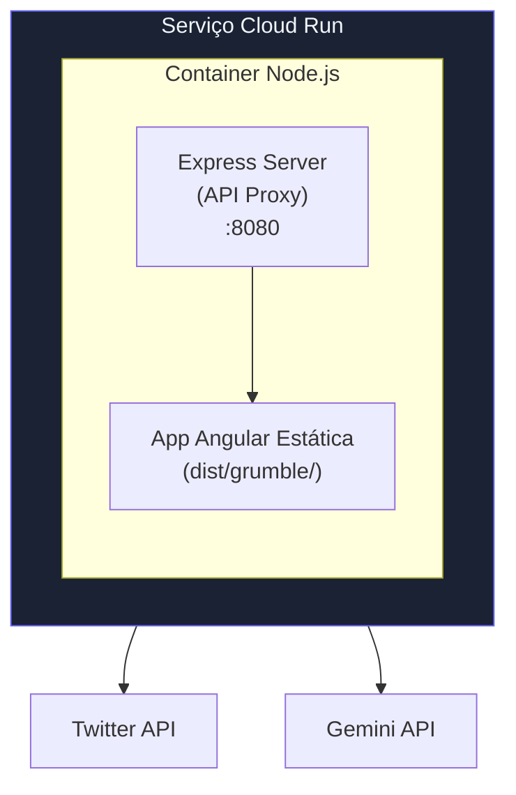

# Guia de Deploy no Cloud Run

Este guia fornece instruções passo a passo para fazer deploy do Grumble no Google Cloud Run.

---

## Sumário

1. [Pré-requisitos](#pré-requisitos)
2. [Visão Geral da Arquitetura](#visão-geral-da-arquitetura)
3. [Passo 1: Configuração do Projeto](#passo-1-configuração-do-projeto)
4. [Passo 2: Configuração do Build](#passo-2-configuração-do-build)
5. [Passo 3: Deploy no Cloud Run](#passo-3-deploy-no-cloud-run)
6. [Passo 4: Configuração de Domínio Customizado](#passo-4-configuração-de-domínio-customizado)
7. [Solução de Problemas](#solução-de-problemas)

---

## Pré-requisitos

Antes de fazer o deploy, certifique-se de ter:

| Requisito | Descrição |
|-----------|-----------|
| **Google Cloud SDK** | Instale de [cloud.google.com/sdk](https://cloud.google.com/sdk) |
| **Projeto no Google Cloud** | Com faturamento habilitado |
| **Projeto Firebase** | Para autenticação (mesmo projeto recomendado) |
| **Docker** | Opcional, para testes locais |

### Verificar Instalação

```bash
# Verificar se gcloud está instalado
gcloud --version

# Login no Google Cloud
gcloud auth login

# Definir seu projeto
gcloud config set project SEU_PROJECT_ID
```

---

## Visão Geral da Arquitetura

O deploy cria um único container que executa:



### Processo de Build

O `Dockerfile` usa um build multi-stage:

1. **Stage 1 (builder)**: Instala dependências npm e builda o app Angular
2. **Stage 2 (production)**: Cria uma imagem mínima com Express + assets buildados

---

## Passo 1: Configuração do Projeto

### Habilitar APIs Necessárias

```bash
# Habilitar Cloud Build, Cloud Run e Container Registry
gcloud services enable \
    cloudbuild.googleapis.com \
    run.googleapis.com \
    containerregistry.googleapis.com
```

### Configurar Permissões

O Cloud Build precisa de permissão para fazer deploy no Cloud Run:

```bash
# Obter a conta de serviço do Cloud Build
PROJECT_NUMBER=$(gcloud projects describe $GOOGLE_CLOUD_PROJECT --format='value(projectNumber)')

# Conceder role de Cloud Run Admin
gcloud projects add-iam-policy-binding $GOOGLE_CLOUD_PROJECT \
    --member="serviceAccount:$PROJECT_NUMBER@cloudbuild.gserviceaccount.com" \
    --role="roles/run.admin"

# Conceder role de Service Account User
gcloud projects add-iam-policy-binding $GOOGLE_CLOUD_PROJECT \
    --member="serviceAccount:$PROJECT_NUMBER@cloudbuild.gserviceaccount.com" \
    --role="roles/iam.serviceAccountUser"
```

---

## Passo 2: Configuração do Build

### Visão Geral dos Arquivos

| Arquivo | Propósito |
|---------|-----------|
| `Dockerfile` | Configuração de build Docker multi-stage |
| `cloudbuild.yaml` | Definição do pipeline Cloud Build |
| `deploy.sh` | Script automatizado de deploy |
| `.dockerignore` | Arquivos a excluir do contexto Docker |

### Detalhes do Dockerfile

```dockerfile
# Stage 1: Build do app Angular
FROM node:22-alpine AS builder
# ... builda o frontend Angular

# Stage 2: Runtime de produção
FROM node:22-alpine AS production
# ... executa servidor Express com arquivos estáticos
```

### Configuração do Cloud Build

O `cloudbuild.yaml` define três passos:

1. **Build**: Cria imagem Docker com tag do commit SHA
2. **Push**: Faz upload para o Container Registry
3. **Deploy**: Faz deploy no Cloud Run com recursos especificados

**Recursos padrão:**
- Memória: 512Mi
- CPU: 1 vCPU
- Instâncias mínimas: 0 (escala para zero)
- Instâncias máximas: 10

---

## Passo 3: Deploy no Cloud Run

### Opção A: Script Automatizado (Recomendado)

```bash
# Do diretório raiz grumble/
export GOOGLE_CLOUD_PROJECT="seu-project-id"
./deploy/cloudrun/deploy.sh
```

O script irá:
1. ✅ Verificar se gcloud está instalado
2. ✅ Definir o projeto correto
3. ✅ Habilitar APIs necessárias
4. ✅ Submeter build ao Cloud Build
5. ✅ Fazer deploy no Cloud Run
6. ✅ Exibir a URL do serviço

### Opção B: Deploy Manual

```bash
# Navegue até a raiz do projeto
cd /caminho/para/grumble

# Submeta o build com Cloud Build
gcloud builds submit \
    --config=deploy/cloudrun/cloudbuild.yaml \
    --substitutions=_SERVICE_NAME=grumble,_REGION=us-central1 \
    .
```

### Verificar Deploy

```bash
# Verificar status do serviço
gcloud run services describe grumble --region=us-central1

# Obter a URL do serviço
gcloud run services describe grumble \
    --region=us-central1 \
    --format='value(status.url)'
```

---

## Passo 4: Configuração de Domínio Customizado

### Mapear Domínio ao Cloud Run

```bash
# Criar mapeamento de domínio
gcloud beta run domain-mappings create \
    --service=grumble \
    --domain=app.seudominio.com \
    --region=us-central1
```

### Configurar DNS (Exemplo GoDaddy)

1. **Login** no GoDaddy → Gerenciamento de DNS do seu domínio

2. **Adicionar registro CNAME**:
   | Tipo | Nome | Valor | TTL |
   |------|------|-------|-----|
   | CNAME | app | ghs.googlehosted.com | 1 Hora |

3. **Aguardar propagação** (15 minutos a 24 horas)

4. **Verificar** no Cloud Console → Cloud Run → Domain Mappings
   - Status deve mudar de "Pending" para "Active"
   - Certificado SSL é provisionado automaticamente

### Para Domínio Raiz (apex)

Se você quer `seudominio.com` (sem subdomínio):

1. Obtenha os endereços IP no Cloud Console
2. Adicione registros A no GoDaddy:
   | Tipo | Nome | Valor |
   |------|------|-------|
   | A | @ | [IP do Google] |
   | A | @ | [Segundo IP se fornecido] |

---

## Solução de Problemas

### Falhas de Build

**Erro: "npm ci failed"**
- Verifique se `package-lock.json` está commitado
- Certifique-se que a versão do Node corresponde (22-alpine)

**Erro: "COPY failed: file not found"**
- Execute a partir do diretório raiz do projeto
- Verifique se `.dockerignore` não está excluindo arquivos necessários

### Falhas de Deploy

**Erro: "Permission denied"**
- Certifique-se que as permissões IAM estão configuradas (veja Passo 1)
- Verifique se você está autenticado: `gcloud auth list`

**Erro: "Container failed to start"**
- Verifique os logs: `gcloud run services logs read grumble --region=us-central1`
- Verifique se PORT está definido como 8080

### Problemas de Mapeamento de Domínio

**Status travado em "Pending"**
- Propagação DNS pode levar até 24 horas
- Verifique se o registro CNAME está correto: `dig app.seudominio.com CNAME`
- Verifique erros de digitação no nome do domínio

**Certificado SSL não provisionando**
- Domínio deve ser publicamente acessível
- DNS deve resolver corretamente
- Aguarde até 24 horas para provisionamento inicial

---

## Teste Local

Teste o build Docker localmente antes de fazer deploy:

```bash
# Build local
docker build -f deploy/cloudrun/Dockerfile -t grumble-local .

# Executar localmente
docker run -p 8080:8080 grumble-local

# Testar
curl http://localhost:8080/api/health
```

---

## Atualizando o Deploy

Após fazer alterações no código:

```bash
# Simplesmente re-execute o script de deploy
./deploy/cloudrun/deploy.sh
```

Ou dispare um novo build manualmente:

```bash
gcloud builds submit \
    --config=deploy/cloudrun/cloudbuild.yaml \
    --substitutions=_SERVICE_NAME=grumble,_REGION=us-central1 \
    .
```

O Cloud Run automaticamente roteia o tráfego para a nova revisão.

---

## Considerações de Custo

Com a configuração padrão:

| Recurso | Configuração | Implicação de Custo |
|---------|--------------|---------------------|
| Instâncias mínimas | 0 | Sem custo quando idle (escala para zero) |
| Instâncias máximas | 10 | Limita custos máximos |
| Memória | 512Mi | ~$0.00002/segundo quando executando |
| CPU | 1 vCPU | ~$0.00002/segundo quando executando |

**Custo estimado**: Próximo de zero para baixo tráfego, ~$5-10/mês para uso moderado.

Para elegibilidade ao nível gratuito, Cloud Run oferece:
- 2 milhões de requisições/mês
- 360.000 GB-segundos de memória
- 180.000 vCPU-segundos de computação
